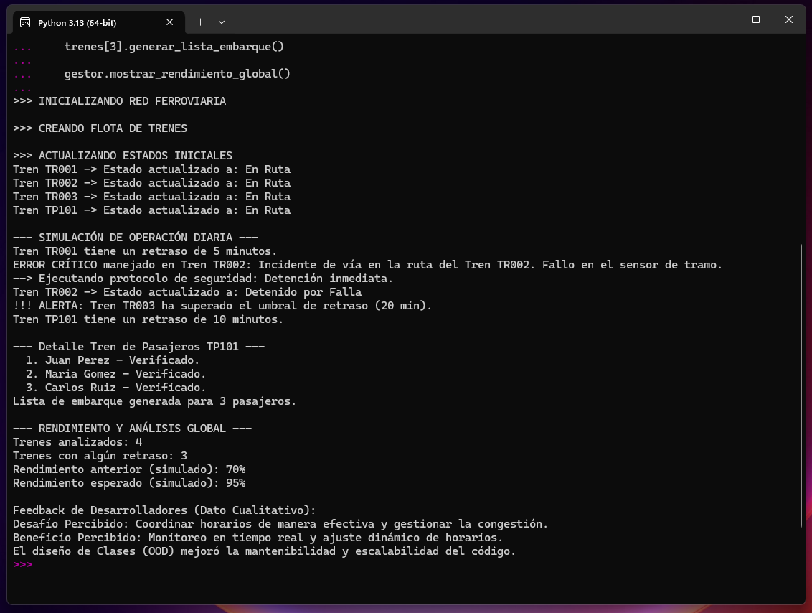

# Proyecto: Gestión de Horarios y Rutas para "Ferroviaria del Sur"

Este repositorio contiene la solución informática desarrollada como parte del **Método Caso U05: Diseño Básico de Clases y Estructuras Comunes** para la asignatura de **Fundamentos de Programación** de la Licenciatura en Ingeniería en Ciberseguridad.

---

## Objetivo del Proyecto

El objetivo principal es modelar una solución de gestión ferroviaria que demuestre la aplicación práctica de los fundamentos de la programación estructurada y el **Diseño Orientado a Objetos (OOD)** para mejorar la **eficiencia, mantenibilidad y robustez** de las operaciones de "Ferroviaria del Sur".

El código fuente (`ferroviaria_sur.py`) simula la operación diaria de una flota de trenes, enfocándose en la **toma de decisiones dinámica** (retrasos, alertas) y el **manejo seguro de incidentes** (excepciones).

---

## Tecnologías Utilizadas

* **Lenguaje:** Python 3.13+
* **Librerías:** `networkx` (Utilizada para modelar la red ferroviaria como un Grafo Dirigido).

---

## Conceptos Clave Implementados

El diseño del código responde directamente a las preguntas planteadas en el Método Caso, demostrando la aplicación de:

1.  **Diseño Orientado a Objetos (OOD):** Implementación de las Clases `Grafo`, `Tren`, y la subclase `TrenDePasajeros` para modelar las entidades del mundo real.
    * **Mantenibilidad y Escalabilidad (Pregunta 3):** La herencia (`TrenDePasajeros` hereda de `Tren`) permite añadir nuevos tipos de trenes sin modificar el código base.
2.  **Sentencias Condicionales (`if/else`):**
    * **Toma de Decisiones (Pregunta 1):** Utilizadas en el método `aplicar_retraso` para activar una **Alerta de Seguridad** si el retraso supera un `UMBRAL_RETRASO_ALARMA` (15 min).
3.  **Bucles (`for`):**
    * **Automatización de Tareas (Pregunta 2):** Utilizados en `GestorHorarios.simular_operacion()` para iterar sobre la flota completa de trenes y en la generación de la lista de embarque de los trenes de pasajeros.
4.  **Manejo de Errores (`try/except`):**
    * **Robustez y Seguridad (Pregunta 4):** El bloque `try-except` en `simular_operacion` simula la detección de un fallo crítico (como un "Incidente de vía") y ejecuta una rutina de contingencia (`Detenido por Falla`) para garantizar la continuidad operativa y la seguridad.

---

## Estructura del Código (`ferroviaria_sur.py`)

| Clase / Sección | Responsabilidad Principal | Fundamento Teórico |
| :--- | :--- | :--- |
| **`Grafo`** | Modelado de la red de rutas (estaciones y distancias). | Estructuras de Datos / OOD |
| **`Tren`** | Clase base para atributos comunes (ID, estado, retraso). | OOD / Herencia |
| **`TrenDePasajeros`** | Extiende `Tren`. Lógica específica (capacidad, reservas). | OOD / Escalabilidad |
| **`GestorHorarios`** | Orquesta la simulación y el monitoreo de la flota. | OOD / Lógica de Negocio |
| **`if __name__ == "__main__":`** | Inicialización de objetos y ejecución del flujo de simulación. | Punto de entrada del programa |

---

## Ejecución y Prueba

### Prerrequisitos

Para ejecutar el script, asegúrate de tener Python instalado y la librería `networkx`:

`pip install networkx`

### Resultados de la Ejecución

El script se ejecuta sin necesidad de *input* del usuario (simulación por lotes). A continuación, se muestra una captura de pantalla de la inicialización de las rutas, que demuestra el correcto funcionamiento del método `agregar_arista` y la estructura del grafo.

---

**Comandos de Ejecución:**

`python ferroviaria_sur.py`
