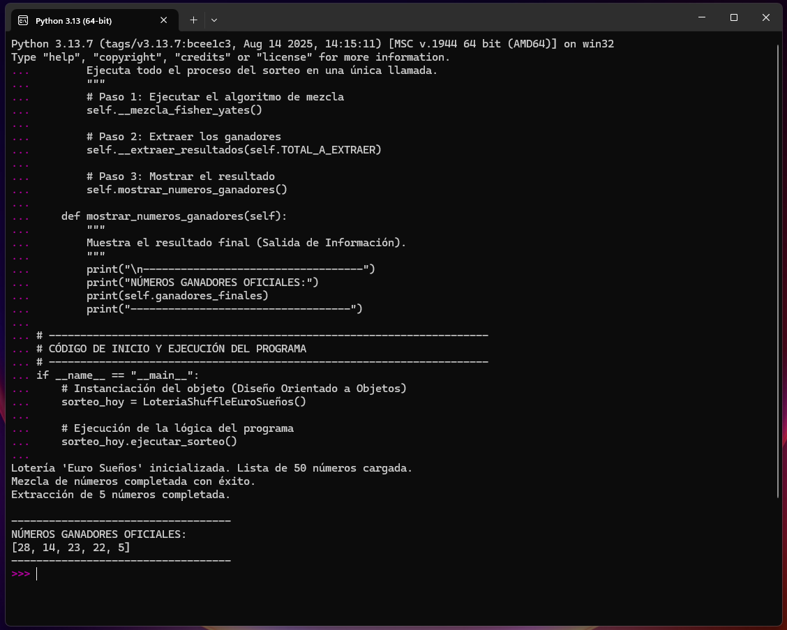

# Solución: Algoritmo de Mezcla Aleatoria (Shuffle)

## Método Caso: Málaga Abierta
**Asignatura:** Fundamentos de Programación
**Unidad:** U1 - Diseño Elemental de Programas y Mecanismos de Abstracción

---

## Objetivo del Proyecto

Implementar una solución de software, basada en el diseño Orientado a Objetos (POO), para el proceso de selección de números de la lotería "Euro Sueños". El objetivo principal es garantizar una alta calidad y uniformidad en la **aleatoriedad** de la mezcla de números, reemplazando métodos ineficientes.

El código fuente se encuentra en el archivo: [`Metodo-caso-Malaga-Abierta/loteria_shuffle.py`](./loteria_shuffle.py)

---

## Conceptos de Programación Aplicados

El diseño del algoritmo demuestra la aplicación práctica de los siguientes fundamentos:

| Concepto | Aplicación en el Código |
| :--- | :--- |
| **Diseño Orientado a Objetos (POO)** | El algoritmo está encapsulado en la `clase LoteriaShuffleEuroSueños`, utilizando atributos de clase (constantes) y de instancia (listas). |
| **Abstracción** | El método `ejecutar_sorteo()` abstrae el proceso complejo (mezcla + extracción) en una única llamada simple para el usuario. |
| **Modularidad y Alcance** | Uso de métodos privados (ej. `__intercambiar()`) para encapsular tareas específicas. Este método actúa como una **función auxiliar** accesible solo por la función principal (`__mezcla_fisher_yates()`), demostrando el uso de **alcance (ámbito)**. |
| **Algoritmo de Mezcla** | Se emplea el algoritmo **Fisher-Yates**, conocido por producir permutaciones aleatorias uniformes, garantizando la imparcialidad del sorteo. |

---

## Ejecución del Código

El programa requiere un intérprete de **Python 3.x** (compatible con Python 3.13).

1.  **Requisito:** Asegúrate de tener Python instalado.
2.  **Clonar o Descargar:** Descarga el archivo `loteria_shuffle.py`.
3.  **Ejecutar:** Abre tu terminal o línea de comandos, navega hasta la ubicación del archivo y ejecuta el siguiente comando:

---

### Captura de la Ejecución Exitosa

A continuación, se muestra la salida del programa, demostrando la abstracción del proceso en la clase `LoteriaShuffleEuroSueños` al ejecutar el sorteo:

