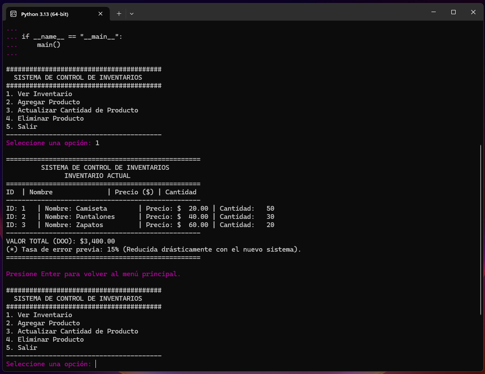
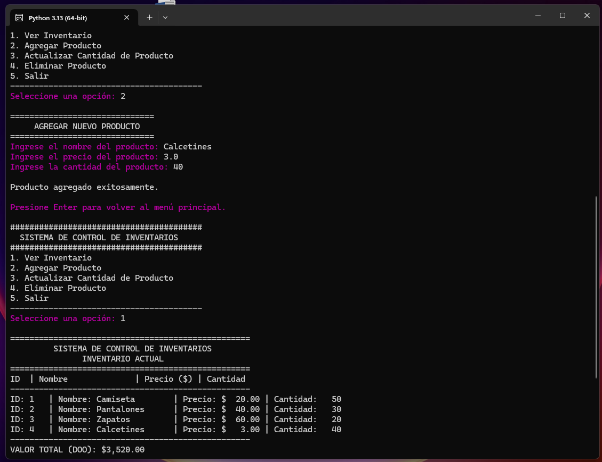
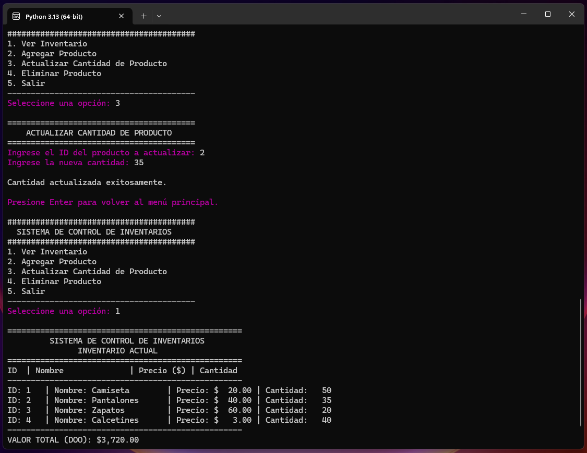
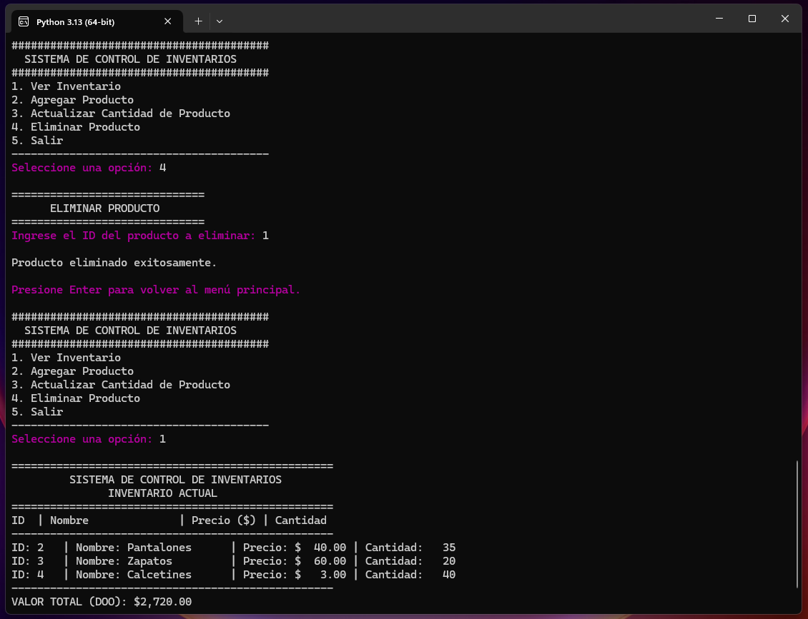

# Sistema de Gestión de Inventarios para PYME "Mercaderías de América"

## Resumen del Proyecto

Este proyecto es la solución práctica para el caso de estudio **"Mercaderías de América"** de la asignatura **Fundamentos de Programación**. El objetivo principal es desarrollar un sistema de gestión de inventarios basado en consola (CLI) que implemente **Diseño Orientado a Objetos (DOO)** y **estructuras de datos sencillas** para mitigar el 15% de inexactitud que experimentaba la PYME en su inventario.

---

## 💻 Características y Tecnologías

* **Lenguaje:** Python 3.13
* **Paradigma Principal:** Diseño Orientado a Objetos (DOO)
* **Estructura de Datos:** Lista (implementada como Array/Arreglo dinámico) para almacenar objetos `Producto`.
* **Operaciones Implementadas:** Inserción, Búsqueda, Eliminación y Recorrido de datos.
* **Modularidad:** Código organizado por módulos lógicos (Clases, Funcionalidades, Interfaz/Control Principal).
* **Integración de Fragmentos:** Se ha integrado la clase `Producto` y una versión de la función `calcular_total` que opera con listas de diccionarios, según lo requerido por el anexo.

---

## Ejecución del Código

El programa requiere un intérprete de **Python 3.x** (compatible con Python 3.13).

1.  **Requisito:** Asegúrate de tener Python instalado.
2.  **Clonar o Descargar:** Descarga el archivo `gestion_inventario.py`.
3.  **Ejecutar:** Abre tu terminal o línea de comandos, navega hasta la ubicación del archivo y ejecuta el siguiente comando:

`python gestion_inventario.py` 

El programa se iniciará automáticamente, mostrando el menú principal en la consola.

---

## Pruebas de Funcionalidad (Screenshots)

A continuación, se presentan las pruebas de ejecución que demuestran la funcionalidad completa del sistema.

### 1. Ver Inventario
Muestra la lista de productos preexistentes y el valor total, incluyendo una referencia a la tasa de error anterior.

### 2. Agregar Producto
Demuestra la inserción de un nuevo producto, con manejo de *input* para nombre, precio y cantidad.

### 3. Actualizar Cantidad de Producto
Permite la búsqueda de un producto por ID y la modificación de su cantidad.

### 4. Eliminar Producto
Muestra el proceso de eliminación de un producto específico por su ID.

---

## 🔗 Referencia de Archivos

| Archivo | Descripción |
| :--- | :--- |
| `gestion_inventario.py` | Código fuente principal de la solución, implementando DOO y las funcionalidades CRUD. |
| `README.md` | Este archivo, documentación del proyecto. |
| `prueba-ver.png` | Captura de pantalla de la funcionalidad de "Ver Inventario". |
| `prueba-agregar.png` | Captura de pantalla de la funcionalidad de "Agregar Producto". |
| `prueba-actualizar.png` | Captura de pantalla de la funcionalidad de "Actualizar Cantidad". |
| `prueba-eliminar.png` | Captura de pantalla de la funcionalidad de "Eliminar Producto". |

